# 3.2 How Solana Works

---

## Why This Matters

Understanding Solana's internals helps you:
- Debug issues in your applications
- Choose the right infrastructure
- Understand trade-offs in design decisions
- Appreciate why certain behaviors exist

This module covers the eight innovations in depth, plus the network architecture and client ecosystem.

---

## 🟢 General Understanding

### The Eight Innovations Working Together

Think of Solana as a factory assembly line:


Each innovation handles one step, optimized for speed.

### Example: One Transaction End-to-End


This is why apps can feel fast: the system is built for short, predictable
paths from intent to confirmation.

### How the Peer-to-Peer Network Stays Connected

**The Gossip Protocol**

How do thousands of computers find and talk to each other without a central server?


**How Gossip Works**


**Why Random Peer Selection?**

- If peers were fixed, attackers could target them
- Random selection means unpredictable topology
- Network self-heals (if peer dies, choose another)

**Seed Nodes**

New validators need to find the network:


Seed nodes are bootstrap points, not central authorities. After connecting, they're not needed.

### How Solana Launched from Genesis

Every blockchain starts from a "genesis block." But how?

**Genesis Configuration**

The genesis defines initial state:
```yaml
# Illustrative (not actual genesis values)
cluster_type: mainnet-beta
genesis_time: "<timestamp>"

initial_validators:
  - pubkey: "<validator_pubkey>"
    stake: <lamports>

initial_accounts:
  - address: "<account_pubkey>"
    lamports: <lamports>

programs:
  - system_program: "11111111..."
```

**The Launch Sequence**


**Why This Works**

All validators:
- Start with identical state (genesis)
- Follow identical rules (client software)
- Build on the same chain

The chain "emerges" from consensus, not from a central server.

> ✅ **Check Your Understanding**
> - [ ] How does gossip protocol spread information?
> - [ ] What are seed nodes and why are they needed?
> - [ ] What's in a genesis configuration?
> - [ ] How do all validators start with the same state?

---

## 🟡 PM/EM Depth

### What Are Blockchain "Clients"?

A **client** is software that implements the blockchain protocol. Think of it like different web browsers implementing HTTP:


**Why Multiple Clients Matter**

| Benefit | Explanation |
|---------|-------------|
| No single point of failure | Bug in one client doesn't affect others |
| Defense in depth | Different codebases, different bugs |
| Competition | Drives performance improvements |
| Decentralization | No single team controls the software |

**Solana's Client History**


**Anza and Agave**

Anza maintains the Agave validator client (as of [docs.anza.xyz](https://docs.anza.xyz/)).

### Why Was the Solana Labs GitHub Archived?

The `solana-labs/solana` repository is archived on GitHub, while the active validator client is developed in the `anza-xyz/agave` repository (as of the GitHub repository status and [docs.anza.xyz](https://docs.anza.xyz/)).

### Firedancer: Why It Matters

Jump Crypto is building Firedancer, a new Solana validator client written in C (as of [Jump Crypto](https://jumpcrypto.com/firedancer)):

**Technical Goal**
- C-based implementation focused on performance

**What It Means for the Network**


### Multiple Concurrent Leaders?

Solana expects **one leader per slot**. Blocks from any other validator for that slot are rejected. There can be temporary forks during partitions, but each slot still has a single expected leader according to the leader schedule (as of [Solana leader rotation docs](https://docs.solanalabs.com/consensus/leader-rotation)).

### Alpenglow (Proposed Consensus Rewrite)

**Alpenglow** is a proposed new consensus protocol by Anza that replaces TowerBFT and Proof of History with new components (Votor for voting/finality and Rotor for data dissemination). It is **not deployed** as of today; published targets are based on simulations and research (as of [Anza’s Alpenglow announcement](https://www.anza.xyz/blog/alpenglow-a-new-consensus-for-solana)). Treat performance numbers as aspirational until implemented and activated.

### Feature Gates: How Protocol Changes Deploy

Unlike traditional software, protocol changes require coordinated validator upgrades and feature activation.

**The Feature Gate System**


> 📊 **Business Context**: Feature gates enable upgrades without hard forks but require validator coordination and social consensus.

### Governance: How Decisions Are Made

Solana governance is primarily off-chain, with protocol changes flowing through SIMDs and validator upgrades (as of [docs.solanalabs.com/proposals](https://docs.solanalabs.com/proposals)):

**Decision-Making Layers**

| Layer | What It Decides | Who Decides |
|-------|-----------------|-------------|
| Protocol | Technical changes (SIMDs) | Core contributors + validators |
| Validator | Run features, choose clients | Individual operators |
| Foundation | Grants, ecosystem support | Foundation board |
| Labs/Anza | Client development priorities | Engineering teams |

**Solana Improvement Documents (SIMDs)**

SIMDs define proposed protocol changes and their discussion process (as of [docs.solanalabs.com/proposals](https://docs.solanalabs.com/proposals)).

**Validator Voting**

On-chain stake-weighted voting for feature activation:
- Validators signal readiness by running upgraded software
- Activation requires a supermajority of stake to upgrade; thresholds are network-configured and can change over time (as of Solana validator documentation)

> ✅ **Check Your Understanding**
> - [ ] What is a blockchain client?
> - [ ] What does Anza maintain today?
> - [ ] What's Firedancer and who's building it?
> - [ ] How do feature gates prevent network splits?
> - [ ] Who decides on protocol changes?

---

## 🔵 Engineer Depth

### Proof of History: Deep Technical Dive

**The Hash Chain**

```rust
// Simplified PoH loop
fn poh_tick(state: &mut PohState) {
    loop {
        state.hash = sha256(&state.hash);
        state.tick_count += 1;

        if state.tick_count % TICKS_PER_SLOT == 0 {
            // Slot boundary
            break;
        }
    }
}
```

**Mixing Data Into PoH**

When transactions arrive:

```rust
fn mix_transaction(state: &mut PohState, tx: &Transaction) {
    // Hash includes previous hash AND transaction data
    let mut hasher = Sha256::new();
    hasher.update(&state.hash);
    hasher.update(&tx.serialize());
    state.hash = hasher.finalize();

    // Record the position
    state.entries.push(Entry {
        hash: state.hash,
        transactions: vec![tx.clone()],
        tick_count: state.tick_count,
    });
}
```

**Verification**

```rust
fn verify_poh(entries: &[Entry]) -> bool {
    let mut expected_hash = entries[0].previous_hash;

    for entry in entries {
        // Verify each entry's hash chain
        for _ in 0..entry.num_ticks {
            expected_hash = sha256(&expected_hash);
        }

        // Mix in transactions
        for tx in &entry.transactions {
            expected_hash = sha256([expected_hash, tx.hash()]);
        }

        if expected_hash != entry.hash {
            return false;
        }
    }
    true
}
```

### Tower BFT Consensus

Tower BFT is PBFT modified to use PoH:

**Vote Lockouts**

When a validator votes for a slot, they're "locked" to that fork:

```
Vote for slot 100:
- Locked for 2 slots (can't vote for conflicting fork for slots 100-101)

Vote for slot 101 (same fork):
- Previous lockout doubles: 4 slots
- New vote: 2 slots

Vote for slot 102 (same fork):
- Previous lockouts: 8 slots, 4 slots
- New vote: 2 slots

Each consecutive vote doubles the oldest lockout.
```

**Why Lockouts Work**

```
Validator wants to vote for conflicting fork:
- Must wait out all lockouts first
- Exponential lockouts mean long waits
- Other validators have moved on
- Fork becomes impossible to finalize

This provides "finality" without explicit finalization messages.
```

> 💡 **ELI5: Tower BFT**
>
> Imagine a **betting game where you can change your mind, but it gets expensive**:
> - You bet $1 on Team A. To change your bet, wait 2 minutes.
> - You bet again on Team A. Now wait 4 minutes to change.
> - Bet again? Wait 8 minutes. Then 16. Then 32...
>
> **The clever part**: After a few bets on the same team, you'd have to wait hours to switch. By then, the game is over! Everyone knows you're committed.
>
> **How this creates finality**: Once enough validators have voted on the same chain several times, they're all "locked in" — switching would take so long that the network moves on without them. No need to wait for a special "this is final!" message.

**Vote Structure**

```rust
struct Vote {
    slots: Vec<Slot>,           // Slots being voted for
    hash: Hash,                  // Blockhash of last slot
    timestamp: Option<i64>,      // Unix timestamp (leader only)
    authorized_voter: Pubkey,    // Who's voting
}
```

### Turbine: Block Propagation

How do you send large blocks to all validators quickly? (as of [Solana Turbine docs](https://docs.solanalabs.com/consensus/turbine-block-propagation))

**Shredding**


**Tree Propagation**

Instead of leader sending to everyone:


**Neighborhood Structure**

Validators are organized into layers with stake-weighted selection:

```
High stake: Early layers (more responsibility)
Low stake: Later layers (less critical path)

Benefits:
- High-stake validators are well-connected
- Attack on small validators doesn't affect propagation
- Stake-weighted importance
```

### Gulf Stream: Transaction Forwarding

Traditional blockchains typically expose a public mempool. Solana avoids a public, gossip-based mempool, but validators still maintain local queues and forward transactions directly to scheduled leaders.

**Traditional Mempool**


**Gulf Stream**


**Leader Schedule**

```
The schedule is known in advance:

Slot 100: Leader = Validator A
Slot 101: Leader = Validator B
Slot 102: Leader = Validator C
Slot 103: Leader = Validator A
...

RPC knows who to send transactions to.
```

**Benefits**
- Lower latency (no mempool queueing)
- Less spam (leaders can apply stake-weighted QoS)
- More predictable (know when your transaction will be processed)


### Sealevel: Parallel Execution

Solana can execute non-conflicting transactions in parallel:

**The Key Insight**

Transactions declare which accounts they'll read/write:

```rust
Transaction {
    accounts: [
        AccountMeta { pubkey: A, is_writable: true },   // Write A
        AccountMeta { pubkey: B, is_writable: false },  // Read B
        AccountMeta { pubkey: C, is_writable: true },   // Write C
    ],
    instructions: [...],
}
```

**Conflict Detection**

```
Transaction 1: Write A, Read B
Transaction 2: Read A, Write C
Transaction 3: Write A, Read D

Conflicts:
- Tx1 and Tx2: Tx1 writes A, Tx2 reads A → CONFLICT
- Tx1 and Tx3: Both write A → CONFLICT
- Tx2 and Tx3: Tx2 reads A, Tx3 writes A → CONFLICT

Execution:
- Tx1 runs first (or Tx3)
- Tx2 runs after (needs Tx1's A)
- Tx3 runs after Tx2 (or before Tx1)

If Transaction 4: Write E, Read F → NO CONFLICT with any, run in parallel
```

**Parallel Execution Engine**

```mermaid
flowchart TD
    A[Batch of Transactions] --> B[Conflict Analysis<br/>Build graph: transaction → accounts accessed]
    B --> C[Parallel Scheduling<br/>Non-conflicting batches run on different CPU cores]
    C --> D1[Core 1<br/>Batch A]
    C --> D2[Core 2<br/>Batch B]
    C --> D3[Core 3<br/>Batch C]
    C --> D4[Core 4<br/>Batch D]

    style C stroke:#FFD700,stroke-width:3px,color:#FFD700
```



### Pipelining: GPU + CPU Coordination

Like a CPU pipeline, different stages happen simultaneously:

```
Time  →  T1      T2      T3      T4      T5
─────────────────────────────────────────────
Fetch     B1      B2      B3      B4      B5
          │       │       │       │
Verify    │       B1      B2      B3      B4
          │       │       │       │
Execute   │       │       B1      B2      B3
          │       │       │       │
Commit    │       │       │       B1      B2

B1 = Batch 1, etc.

Different batches at different stages simultaneously.
```

**Hardware Utilization**

| Stage | Hardware |
|-------|----------|
| Fetch | Network card, memory |
| Verify signatures | GPU (parallel crypto) |
| Execute transactions | CPU |
| Commit state | NVMe drive |

### Cloudbreak: Accounts Database

Solana's accounts are stored in a memory-mapped structure:

```
Accounts Database
├── accounts.index (in-memory, maps pubkey → location)
├── accounts/
│   ├── slot_100.accounts (mmap'd files)
│   ├── slot_101.accounts
│   └── ...
└── snapshots/
    └── slot_X/ (periodic full state)
```

**Memory Mapping**

```c
// Simplified
void* accounts = mmap(NULL, size, PROT_READ | PROT_WRITE,
                      MAP_SHARED, fd, 0);

// Access account like regular memory
Account* acc = &accounts[offset];

// OS handles paging to/from disk
// Fast for sequential access patterns
```

**Why NVMe Matters**

Solana's storage workload benefits from high IOPS and low latency storage; NVMe is recommended in validator requirements (as of [docs.anza.xyz/operations/requirements](https://docs.anza.xyz/operations/requirements)).

> ✅ **Check Your Understanding**
> - [ ] How does PoH provide ordering guarantees?
> - [ ] Explain the vote lockout mechanism in Tower BFT
> - [ ] How does Turbine achieve fast block propagation?
> - [ ] What makes Gulf Stream different from a mempool?
> - [ ] How does Sealevel determine which transactions can run in parallel?

---

## Key Takeaways

1. **PoH is a verifiable clock** — proves time without synchronization
2. **Tower BFT uses exponential lockouts** — provides finality without explicit messages
3. **Turbine uses tree propagation** — O(log n) latency for block spread
4. **Gulf Stream skips mempools** — transactions go directly to leaders
5. **Sealevel parallelizes execution** — non-conflicting transactions run simultaneously
6. **Multiple clients improve resilience** — Agave in production; Firedancer in development (as of [docs.anza.xyz](https://docs.anza.xyz/) and [jumpcrypto.com/firedancer](https://jumpcrypto.com/firedancer))
7. **Gossip keeps the network connected** — decentralized peer discovery
8. **Feature gates enable upgrades** — coordinated without hard forks

---

## Next

Now let's understand Solana's unique account model — the foundation for all program development.

→ [3.3 The Solana Account Model](./3.3-solana-account-model.md)
