# 5.1 Client Architectures

> *"The best blockchain UX is one where users don't know they're using a blockchain."*

---

## Why This Matters

A beautiful, well-tested Solana program is useless without clients to interact with it. Understanding client architecture patterns helps you build applications that are performant, reliable, and provide great user experiences.

---

## 🟢 General Understanding

### The Client Landscape

```mermaid
flowchart TD
    subgraph Web["WEB CLIENTS"]
        W1[React / Next.js]
        W2[Vue / Nuxt]
        W3[Plain JavaScript]
    end

    subgraph Mobile["MOBILE CLIENTS"]
        M1[React Native]
        M2[Flutter]
        M3[Native iOS/Android]
    end

    subgraph Backend["BACKEND CLIENTS"]
        B1[Node.js]
        B2[Python]
        B3[Rust]
    end

    subgraph CLI["CLI / SCRIPTS"]
        C1[TypeScript]
        C2[Rust]
        C3[Shell + solana-cli]
    end

    subgraph SDKs["SDK OPTIONS"]
        S1[@solana/web3.js - Official JavaScript SDK]
        S2[@coral-xyz/anchor - Anchor client wraps web3.js]
        S3[@solana/spl-token - Token operations]
        S4[solana-py - Python SDK]
        S5[solana-sdk Rust - Native Rust client]
    end

    style SDKs stroke:#FFD700,stroke-width:3px
```

### Client Responsibilities

| Responsibility | Description |
|----------------|-------------|
| **Transaction Building** | Construct valid transactions with proper accounts |
| **Signing** | Obtain signatures from wallet or keypair |
| **Submission** | Send transactions to RPC |
| **Confirmation** | Wait for and verify transaction success |
| **Account Reading** | Fetch and deserialize account data |
| **Error Handling** | Parse and display meaningful errors |
| **UX** | Provide feedback during async operations |

### Read vs Write Paths (Mental Model)

```
READ PATH: UI → RPC → Account Data → UI
WRITE PATH: UI → Wallet → RPC → Leader → Program → Confirmation → UI
```

Most reliability issues show up on the write path, so invest extra UX
and error handling there.

---

## 🟡 PM/EM Depth

### Architecture Patterns

#### Pattern 1: Direct RPC

```mermaid
flowchart LR
    C[Client<br/>Browser] <--> R[RPC<br/>Node]
    R <--> S[Solana<br/>Network]

    subgraph Pros
        P1[✓ Simple architecture]
        P2[✓ Direct blockchain access]
        P3[✓ Real-time data]
    end

    subgraph Cons
        C1[✗ Rate limits on public RPCs]
        C2[✗ No caching layer]
        C3[✗ Wallet required in browser]
    end

    style C stroke:#FFD700,stroke-width:3px
    style Pros stroke:#00FF00,stroke-width:2px
    style Cons stroke:#FF0000,stroke-width:2px
```



#### Pattern 2: Backend Proxy

```mermaid
flowchart LR
    C[Client<br/>Browser] <--> B[Backend<br/>Server]
    B <--> R[RPC<br/>Node]
    B --> Cache[Cache<br/>Redis, etc.]
    C --> Cache

    subgraph Pros
        P1[✓ Caching for reads]
        P2[✓ Rate limit management]
        P3[✓ Can use private RPC]
        P4[✓ Server-side signing possible]
    end

    subgraph Cons
        C1[✗ Additional infrastructure]
        C2[✗ Potential single point of failure]
        C3[✗ Added latency]
    end

    style B stroke:#FFD700,stroke-width:3px,color:#FFD700
    style Pros stroke:#00FF00,stroke-width:2px
    style Cons stroke:#FF0000,stroke-width:2px
```



#### Pattern 3: Hybrid


### RPC Provider Selection

| Provider | Free Tier | Best For |
|----------|-----------|----------|
| **Helius** | Varies | DeFi, low-latency |
| **Quicknode** | Varies | Enterprise, reliability |
| **Triton One** | Varies | High-volume |
| **Alchemy** | Varies | Multi-chain apps |
| **Public RPC** | Rate limited | Development only |

### Indexing Solutions

For complex queries beyond RPC capabilities:

| Solution | Use Case |
|----------|----------|
| **Helius DAS** | NFT metadata, compressed NFTs |
| **The Graph** | Custom subgraphs |
| **Shyft** | Real-time indexing |
| **Custom Geyser** | Full control, high volume |
| **PostgreSQL + listener** | Moderate volume, custom needs |

---

## 🔵 Engineer Depth

### Project Structure

```
my-solana-app/
├── src/
│   ├── lib/
│   │   ├── solana/
│   │   │   ├── connection.ts      # RPC connection setup
│   │   │   ├── transactions.ts    # Transaction builders
│   │   │   ├── accounts.ts        # Account fetchers
│   │   │   └── program.ts         # Program client (Anchor)
│   │   ├── hooks/
│   │   │   ├── useProgram.ts      # React hook for program
│   │   │   ├── useAccount.ts      # Account subscription
│   │   │   └── useTransaction.ts  # Transaction state
│   │   └── utils/
│   │       ├── errors.ts          # Error parsing
│   │       └── formatting.ts      # Display helpers
│   ├── components/
│   │   └── ...
│   └── pages/
│       └── ...
├── idl/
│   └── my_program.json            # Program IDL
└── types/
    └── my_program.ts              # Generated types
```

### Connection Management

```typescript
// src/lib/solana/connection.ts
import { Connection, Commitment } from "@solana/web3.js";

// Singleton connection with fallback
class ConnectionManager {
  private connection: Connection | null = null;
  private endpoints: string[];
  private currentIndex = 0;

  constructor(endpoints: string[]) {
    this.endpoints = endpoints;
  }

  getConnection(commitment: Commitment = "confirmed"): Connection {
    if (!this.connection) {
      this.connection = new Connection(
        this.endpoints[this.currentIndex],
        {
          commitment,
          wsEndpoint: this.endpoints[this.currentIndex].replace("https", "wss"),
          confirmTransactionInitialTimeout: 60000,
        }
      );
    }
    return this.connection;
  }

  async rotateEndpoint(): Promise<void> {
    this.currentIndex = (this.currentIndex + 1) % this.endpoints.length;
    this.connection = null;
    console.log(`Rotated to endpoint: ${this.endpoints[this.currentIndex]}`);
  }
}

export const connectionManager = new ConnectionManager([
  process.env.NEXT_PUBLIC_RPC_URL!,
  process.env.NEXT_PUBLIC_RPC_FALLBACK!,
]);

export const getConnection = () => connectionManager.getConnection();
```

### Program Client Pattern

```typescript
// src/lib/solana/program.ts
import { Program, AnchorProvider, Idl } from "@coral-xyz/anchor";
import { Connection, PublicKey } from "@solana/web3.js";
import { MyProgram } from "../../types/my_program";
import IDL from "../../idl/my_program.json";

const PROGRAM_ID = new PublicKey("Your11111111111111111111111111111111111111");

export function getProgram(
  connection: Connection,
  wallet: AnchorProvider["wallet"]
): Program<MyProgram> {
  const provider = new AnchorProvider(
    connection,
    wallet,
    { commitment: "confirmed" }
  );

  return new Program(
    IDL as Idl,
    PROGRAM_ID,
    provider
  ) as Program<MyProgram>;
}

// For read-only operations (no wallet needed)
export function getReadOnlyProgram(connection: Connection): Program<MyProgram> {
  const provider = new AnchorProvider(
    connection,
    {
      publicKey: PublicKey.default,
      signTransaction: async (tx) => tx,
      signAllTransactions: async (txs) => txs,
    },
    { commitment: "confirmed" }
  );

  return new Program(
    IDL as Idl,
    PROGRAM_ID,
    provider
  ) as Program<MyProgram>;
}
```

### React Hook Pattern

```typescript
// src/lib/hooks/useProgram.ts
import { useConnection, useWallet } from "@solana/wallet-adapter-react";
import { useMemo } from "react";
import { getProgram, getReadOnlyProgram } from "../solana/program";

export function useProgram() {
  const { connection } = useConnection();
  const wallet = useWallet();

  const program = useMemo(() => {
    if (wallet.publicKey && wallet.signTransaction) {
      return getProgram(connection, wallet);
    }
    return getReadOnlyProgram(connection);
  }, [connection, wallet.publicKey, wallet.signTransaction]);

  return program;
}

// Usage in component:
function MyComponent() {
  const program = useProgram();

  const fetchData = async () => {
    const account = await program.account.myAccount.fetch(address);
    // ...
  };
}
```

### Error Handling Pattern

```typescript
// src/lib/utils/errors.ts
import { AnchorError } from "@coral-xyz/anchor";

export interface ParsedError {
  code: string;
  message: string;
  isUserFriendly: boolean;
}

export function parseError(error: unknown): ParsedError {
  // Anchor program error
  if (error instanceof AnchorError) {
    return {
      code: error.error.errorCode.code,
      message: error.error.errorMessage,
      isUserFriendly: true,
    };
  }

  // Transaction error
  if (error instanceof Error) {
    // Insufficient funds
    if (error.message.includes("insufficient funds")) {
      return {
        code: "INSUFFICIENT_FUNDS",
        message: "You don't have enough SOL for this transaction",
        isUserFriendly: true,
      };
    }

    // User rejected
    if (error.message.includes("User rejected")) {
      return {
        code: "USER_REJECTED",
        message: "Transaction was cancelled",
        isUserFriendly: true,
      };
    }

    // Timeout
    if (error.message.includes("timeout") || error.message.includes("Timeout")) {
      return {
        code: "TIMEOUT",
        message: "Transaction timed out. Please try again.",
        isUserFriendly: true,
      };
    }
  }

  // Unknown error
  return {
    code: "UNKNOWN",
    message: "An unexpected error occurred",
    isUserFriendly: false,
  };
}
```

### State Management Pattern

```typescript
// Using React Query for caching and refetching
import { useQuery, useMutation, useQueryClient } from "@tanstack/react-query";
import { PublicKey } from "@solana/web3.js";
import { useProgram } from "./useProgram";

export function useAccount(address: PublicKey) {
  const program = useProgram();

  return useQuery({
    queryKey: ["account", address.toString()],
    queryFn: async () => {
      return program.account.myAccount.fetch(address);
    },
    staleTime: 10_000, // Consider fresh for 10s
    refetchInterval: 30_000, // Auto-refetch every 30s
  });
}

export function useUpdateAccount() {
  const program = useProgram();
  const queryClient = useQueryClient();

  return useMutation({
    mutationFn: async ({ address, data }: { address: PublicKey; data: any }) => {
      const tx = await program.methods
        .updateAccount(data)
        .accounts({ myAccount: address })
        .rpc();

      return tx;
    },
    onSuccess: (_, variables) => {
      // Invalidate and refetch
      queryClient.invalidateQueries({
        queryKey: ["account", variables.address.toString()],
      });
    },
  });
}
```

---

## Common Patterns

### Loading States

```typescript
// Transaction with proper loading states
function TransactionButton() {
  const [status, setStatus] = useState<
    "idle" | "signing" | "confirming" | "success" | "error"
  >("idle");

  const handleTransaction = async () => {
    try {
      setStatus("signing");
      const tx = await program.methods.doSomething().rpc();

      setStatus("confirming");
      await connection.confirmTransaction(tx, "confirmed");

      setStatus("success");
    } catch (error) {
      setStatus("error");
      // Handle error
    }
  };

  return (
    <button onClick={handleTransaction} disabled={status !== "idle"}>
      {status === "idle" && "Submit"}
      {status === "signing" && "Sign in wallet..."}
      {status === "confirming" && "Confirming..."}
      {status === "success" && "Success!"}
      {status === "error" && "Error - Try again"}
    </button>
  );
}
```

### Optimistic Updates

```typescript
// Show immediate feedback before confirmation
const updateMutation = useMutation({
  mutationFn: updateOnChain,
  onMutate: async (newData) => {
    // Cancel outgoing refetches
    await queryClient.cancelQueries({ queryKey: ["account"] });

    // Snapshot previous value
    const previous = queryClient.getQueryData(["account"]);

    // Optimistically update
    queryClient.setQueryData(["account"], newData);

    return { previous };
  },
  onError: (err, newData, context) => {
    // Rollback on error
    queryClient.setQueryData(["account"], context?.previous);
  },
  onSettled: () => {
    // Refetch to sync
    queryClient.invalidateQueries({ queryKey: ["account"] });
  },
});
```

---

## Key Takeaways

1. **Choose architecture based on needs** — direct, proxy, or hybrid
2. **Use proper RPC providers** — public RPCs are for dev only
3. **Structure code for maintainability** — separate concerns
4. **Handle errors gracefully** — parse and display user-friendly messages
5. **Manage state effectively** — use React Query or similar
6. **Show loading states** — users need feedback
7. **Consider indexing** — for complex queries

---

## Next

Deep dive into the core JavaScript SDK for Solana.

→ [5.2 @solana/web3.js Deep Dive](./5.2-web3js-deep-dive.md)
