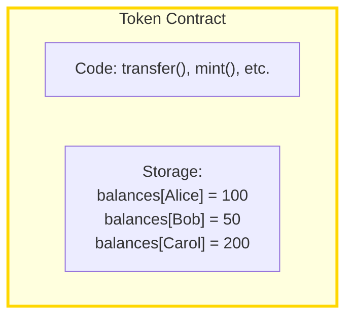
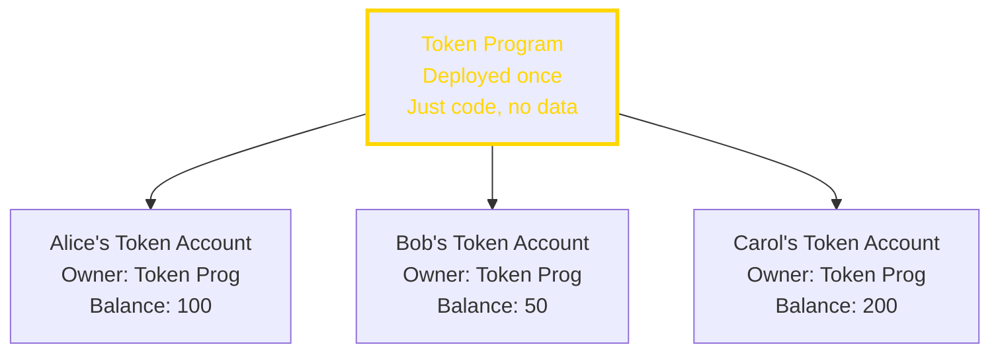
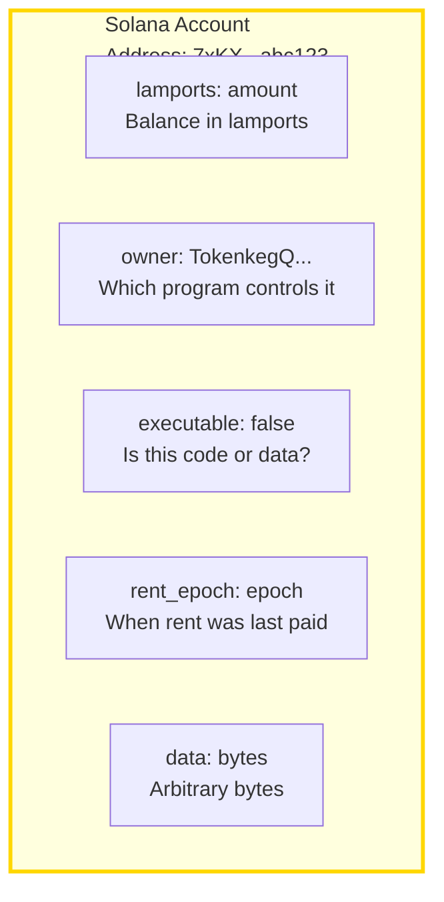
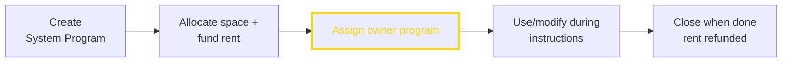
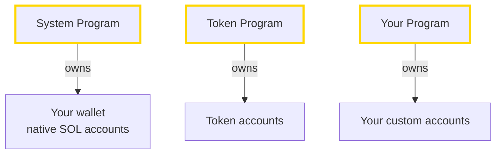
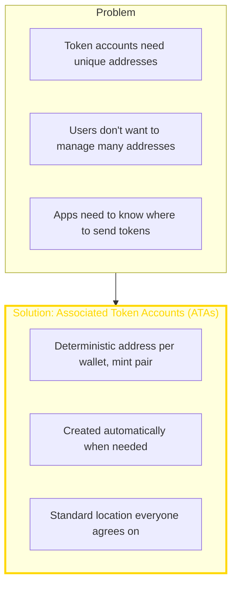
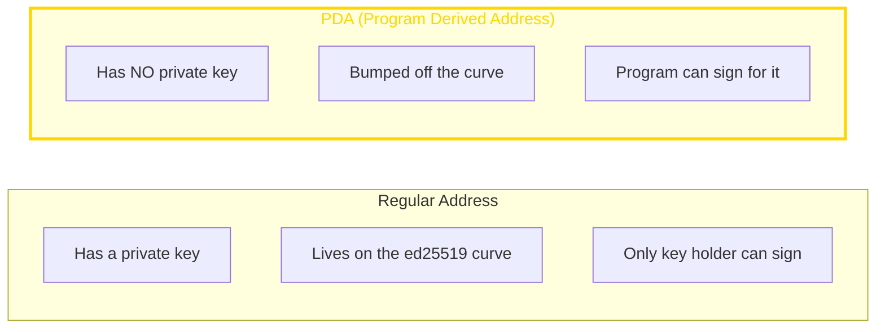
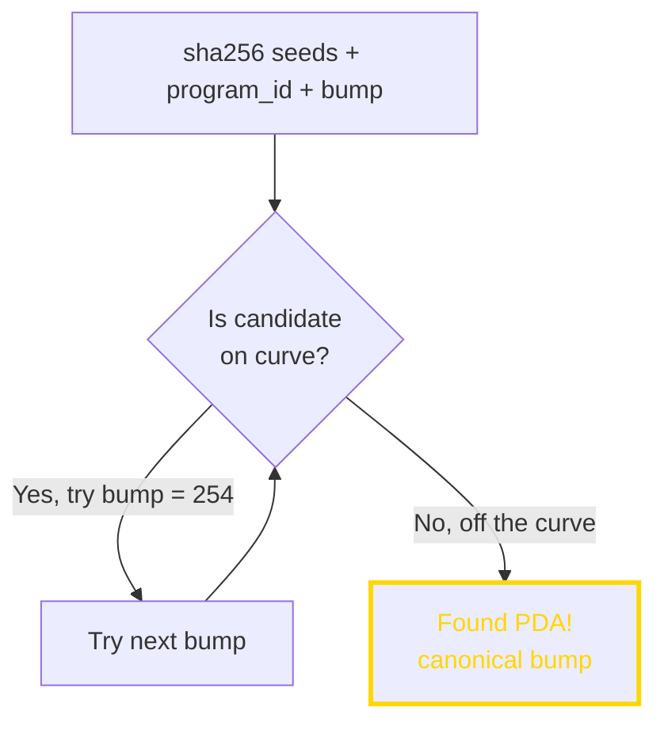
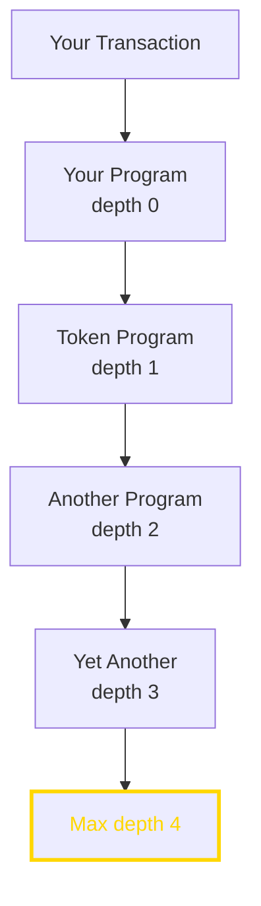

---

## Why This Matters

Solana's account model is fundamentally different from Ethereum's contract model. Understanding this difference is essential for:
- Building applications on Solana
- Understanding why Solana can execute in parallel
- Debugging issues and optimizing performance
- Grasping the mental model of Solana development

This is the "aha moment" module for most developers.

---

## 🟢 General Understanding

### The Big Difference

**Ethereum Model: Smart Contracts Store Their Own Data**



**Solana Model: Programs Are Code-Only, Data Lives Separately**



### Why This Matters for Users

**1. Lower Costs**

In Ethereum, every token contract is deployed separately. In Solana, one token program handles all tokens:

```
Ethereum:
  USDC contract: Deployed, pays for code storage
  USDT contract: Deployed, pays for code storage
  DAI contract: Deployed, pays for code storage
  ... each pays for redundant code

Solana:
  Token program: Deployed once
  USDC mint: Just an account
  USDT mint: Just an account
  DAI mint: Just an account
  ... minimal overhead per token
```

**2. Predictable Addresses**

Your token account address is deterministic:

```
Your USDC account = derived from (your wallet + USDC mint + token program)

You can calculate it without ever seeing it on-chain.
No need to deploy anything.
```

**3. Parallel Execution**

Since data is separate:
- Alice transferring tokens doesn't touch Bob's account
- Both can happen simultaneously
- This is why Solana can run transactions in parallel

### What Is an Account?

An account is a data container with metadata:



### Account Lifecycle (Simple View)



**Key Fields**

| Field | Purpose |
|-------|---------|
| `lamports` | Balance (1 SOL = 1,000,000,000 lamports; as of [solana.com/docs/terminology](https://solana.com/docs/terminology)) |
| `owner` | Program that can modify this account's data |
| `executable` | If true, this account holds program code |
| `data` | The actual content (interpreted by the owner program) |

### The Ownership Model

Every account has an "owner" — a program that controls it:



**Only the owner can:**
- Modify the account's data
- Subtract lamports from the account

**Anyone can:**
- Read the account's data
- Add lamports to the account

> 💡 **Key Insight**: Ownership determines write permission. You "own" your tokens because the Token Program recognizes your wallet as the token account's authority, not because you own the account directly.

> ✅ **Check Your Understanding**
> - [ ] How does Solana's account model differ from Ethereum's?
> - [ ] Why does separation of code and data enable parallelism?
> - [ ] What does "owner" mean for an account?
> - [ ] Can anyone read an account's data?

---

## 🟡 PM/EM Depth

### Rent: Paying for Storage

Storage isn't free. Accounts must be funded to be rent-exempt, and minimum balances still apply (as of [solana.com/docs](https://solana.com/docs)):

**The Rent Model**

```
Option: Rent-exempt (what everyone uses)
  - Deposit minimum balance upfront
  - Account stays forever
  - Minimum depends on account size and network rent parameters
```

**Rent-Exempt Calculation**

```
Minimum balance is calculated from data size and the network rent parameters. Use the CLI or RPC rent-exemption calculators for current values (as of [docs.solanalabs.com/cli](https://docs.solanalabs.com/cli)).
```

**Business Implications**

| Consideration | Impact |
|---------------|--------|
| Account creation cost | Varies with data size and rent parameters |
| Closing accounts | Recovers rent deposit |
| Large data storage | Can become expensive at scale |
| Account reuse | More efficient than creating new |

### Account Types in Practice

**1. Wallet Accounts (System-Owned)**
```
Owner: System Program
Data: Empty (balance only)
Purpose: Hold SOL, sign transactions
```

**2. Token Accounts**
```
Owner: Token Program
Data: Fixed-size token account data
Contains: mint address, owner wallet, balance, delegate, etc.
```

**3. Program Accounts**
```
Owner: BPF Loader
Executable: true
Data: Compiled program bytecode
```

**4. Program Data Accounts (PDAs)**
```
Owner: Your program
Data: Whatever your program needs
Purpose: Store application state
```

### Associated Token Accounts

The most common pattern for token storage:



**ATA Address Derivation**

```
ATA address = PDA derived from:
  - Wallet address
  - Token mint address
  - Token program address
  - Associated Token Program address

// Same inputs always give same output
const ata = await getAssociatedTokenAddress(
  mint,           // Which token
  wallet,         // Whose tokens
);
```

> 📊 **Business Context**: ATAs solved a major UX problem. Before ATAs, sending someone tokens might fail if they didn't have an account for that token. Now, the sender can create the recipient's account automatically.

### Account Lookup Tables (ALTs)

Transactions have a limited size. Each account reference is 32 bytes. ALTs compress this:

```
Without ALT:
  Transaction includes full addresses

With ALT:
  Transaction references a lookup table and indexes

Example sizes vary by transaction; treat this as a conceptual compression model.
```

**When to Use**
- Complex transactions with many accounts
- DeFi swaps (touch many pools)
- Batch operations

> ✅ **Check Your Understanding**
> - [ ] What's the rent-exempt minimum and why does it exist?
> - [ ] What's the difference between a wallet and a token account?
> - [ ] How do Associated Token Accounts solve a UX problem?
> - [ ] When would you use Account Lookup Tables?

---

## 🔵 Engineer Depth

> ⚠️ **Note**: Constants and limits vary by release; verify current values in the Solana source code (as of [`solana-labs/solana`](https://github.com/solana-labs/solana)).

### Account Data Layout

Programs interpret account data according to their own schema:

**Token Account Layout (defined in the SPL Token program; as of [spl.solana.com/token](https://spl.solana.com/token))**

```rust
pub struct Account {
    pub mint: Pubkey,               // 32 bytes: Which token
    pub owner: Pubkey,              // 32 bytes: Who controls it
    pub amount: u64,                // 8 bytes: Balance
    pub delegate: COption<Pubkey>,  // 36 bytes: Optional spender
    pub state: AccountState,        // 1 byte: Initialized/Frozen
    pub is_native: COption<u64>,    // 12 bytes: Wrapped SOL info
    pub delegated_amount: u64,      // 8 bytes: Delegated balance
    pub close_authority: COption<Pubkey>, // 36 bytes: Who can close
}
// Size defined by the SPL Token program layout
```

**Serialization**

Solana programs typically use Borsh (Binary Object Representation Serializer for Hashing):

```rust
use borsh::{BorshDeserialize, BorshSerialize};

#[derive(BorshSerialize, BorshDeserialize)]
pub struct Counter {
    pub count: u64,
    pub authority: Pubkey,
}

// Serialize
let data = counter.try_to_vec()?;

// Deserialize
let counter = Counter::try_from_slice(&account.data)?;
```

### Program Derived Addresses (PDAs)

PDAs are addresses derived deterministically without a private key:

**Why PDAs Exist**

Regular accounts need a signature to authorize changes. But programs can't sign (no private key). PDAs solve this:



**PDA Derivation**

```rust
let (pda, bump) = Pubkey::find_program_address(
    &[
        b"my-seed",           // Static seed
        user.key.as_ref(),    // Dynamic seed (user's key)
    ],
    &program_id,
);

// The "bump" is a number (0-255) that makes the address invalid as a key
// We store the bump to reconstruct the PDA later
```

**How "Bump" Works**



**Signing with PDAs**

Programs can authorize actions for PDAs they derived:

```rust
// In your program
invoke_signed(
    &transfer_instruction,
    &[source.clone(), destination.clone(), pda.clone()],
    &[&[b"my-seed", user.key.as_ref(), &[bump]]],  // PDA seeds
)?;
```

### Account Constraints in Anchor

Anchor framework simplifies account validation:

```rust
#[derive(Accounts)]
pub struct Transfer<'info> {
    #[account(mut)]  // Must be writable
    pub from: Account<'info, TokenAccount>,

    #[account(mut)]
    pub to: Account<'info, TokenAccount>,

    #[account(
        constraint = from.owner == authority.key(),  // Custom constraint
    )]
    pub authority: Signer<'info>,

    pub token_program: Program<'info, Token>,
}
```

**Common Constraints**

| Constraint | Purpose |
|------------|---------|
| `mut` | Account is writable |
| `signer` | Account must sign transaction |
| `init` | Create new account |
| `seeds`, `bump` | Validate PDA derivation |
| `has_one` | Field must match expected value |
| `constraint` | Custom validation logic |

### Cross-Program Invocations (CPIs)

Programs can call other programs:

```rust
// Your program calling the Token Program
use anchor_spl::token::{self, Transfer};

pub fn transfer_tokens(ctx: Context<TransferTokens>, amount: u64) -> Result<()> {
    let cpi_accounts = Transfer {
        from: ctx.accounts.from.to_account_info(),
        to: ctx.accounts.to.to_account_info(),
        authority: ctx.accounts.authority.to_account_info(),
    };

    let cpi_program = ctx.accounts.token_program.to_account_info();
    let cpi_ctx = CpiContext::new(cpi_program, cpi_accounts);

    token::transfer(cpi_ctx, amount)?;
    Ok(())
}
```

**CPI Depth Limit**



CPIs are limited to depth 4 to prevent stack overflow.

### Account Ownership Transitions

Accounts can change owners:

```rust
// System Program creates account owned by your program
invoke(
    &system_instruction::create_account(
        &payer.key(),           // Who pays
        &new_account.key(),     // New account address
        rent_lamports,          // Rent deposit
        data_len as u64,        // Size
        &your_program_id,       // Owner = your program
    ),
    &[payer, new_account],
)?;
```

**Ownership Transfer Rules**

| Action | Who Can Do It |
|--------|---------------|
| Create with specific owner | System Program |
| Change owner | Current owner program |
| Assign to System Program | Any owner (giving up ownership) |
| Close account | Owner program with close authority |

### Compute Units and Account Limits

Transactions have limits:

```rust
// Account limits
const MAX_ACCOUNTS_PER_TX: usize = 64;      // Without ALT
const MAX_ACCOUNTS_WITH_ALT: usize = 256;   // With ALT

// Size limits
const MAX_ACCOUNT_DATA: usize = 10 * 1024 * 1024;  // 10 MB max
const INITIAL_ACCOUNT_DATA: usize = 10 * 1024;      // 10 KB initial

// Compute limits
const DEFAULT_COMPUTE_UNITS: u64 = 200_000;
const MAX_COMPUTE_UNITS: u64 = 1_400_000;
```

**Compute Unit Considerations**

```rust
// Request more compute units if needed
let compute_budget_ix = ComputeBudgetInstruction::set_compute_unit_limit(400_000);

// Add priority fee
let priority_fee_ix = ComputeBudgetInstruction::set_compute_unit_price(1_000);
```

> ✅ **Check Your Understanding**
> - [ ] What is Borsh and why is it used?
> - [ ] How do PDAs differ from regular addresses?
> - [ ] Why can programs "sign" for PDAs?
> - [ ] What's the purpose of Account Lookup Tables?
> - [ ] What happens during a Cross-Program Invocation?

---

## Key Takeaways

1. **Programs are stateless** — all data lives in accounts, code is separate
2. **Accounts have owners** — only the owner program can modify data
3. **PDAs enable program-controlled accounts** — addresses without private keys
4. **Rent-exemption** — deposit a minimum balance for persistent storage
5. **ATAs standardize token storage** — deterministic addresses for tokens
6. **CPIs enable composability** — programs can call other programs
7. **This model enables parallelism** — non-overlapping accounts can execute simultaneously

---
