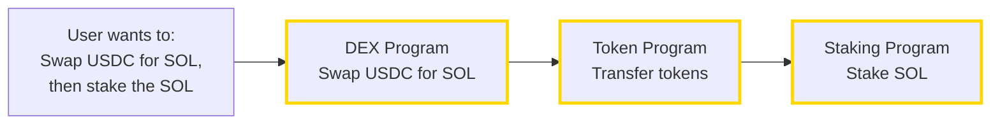
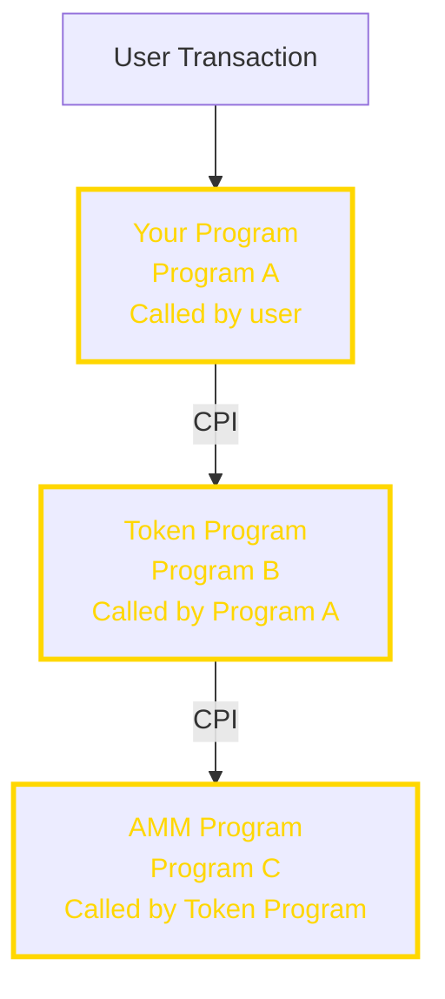
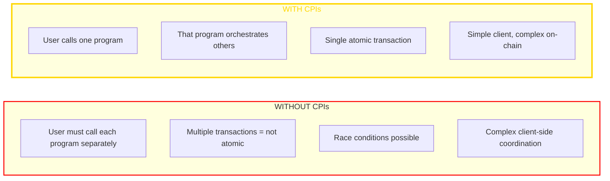
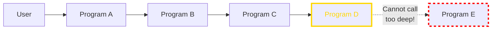

> *"The real power of Solana programs comes from composability — programs calling other programs."*

---

## Why This Matters

In traditional programming, you call functions from libraries. In Solana, you call instructions from other programs. This composability is what makes DeFi possible — your swap program can call the token program, which can call another protocol, all in one atomic transaction.

This module covers:
- How CPIs work
- Invoking other programs safely
- PDA signing for CPIs
- Common CPI patterns

---

## 🟢 General Understanding

### What Is Composability?

Composability means programs can work together like LEGO bricks:



### ELI5: CPIs

**Think of a restaurant kitchen:**
- The **head chef** (your program) gets an order from the customer
- The head chef calls the **sous chef** (token program) to prepare ingredients
- The sous chef might call the **pastry chef** (another program) for dessert
- The whole meal comes out together — or not at all if something fails

**All or nothing**: If the pastry chef burns the dessert, the entire order is cancelled.

### Example: CPI Failure Propagation

```
Your program calls Token Program
  → Token Program rejects (insufficient funds)
  → Your instruction fails
  → Entire transaction rolls back
```

This is why CPI error handling and preflight simulation are so important.

---

## 🟡 PM/EM Depth

### Why CPIs Matter for Products

| Without CPIs | With CPIs |
|--------------|-----------|
| Each app reinvents token transfers | Reuse proven token program |
| Isolated features | Composable features |
| More code = more bugs | Less code = fewer bugs |
| Hard to integrate | Easy to integrate |

### Common CPI Patterns

| Pattern | Programs Involved | Use Case |
|---------|-------------------|----------|
| **Token transfer** | Your program → Token Program | Payments |
| **Swap** | Your program → DEX → Token Program | Trading |
| **Mint NFT** | Your program → Metaplex → Token | NFT creation |
| **Stake** | Your program → Staking → Token | Yield farming |

### Security Considerations for Product Decisions

| Risk | Mitigation | PM Action |
|------|------------|-----------|
| **Re-entrancy** | Solana prevents by design | No action needed |
| **Account confusion** | Validate all passed accounts | Require code review |
| **Privilege escalation** | Careful with PDA signers | Security audit |

---

## 🔵 Engineer Depth

## What Is a CPI?

A Cross-Program Invocation is when one program calls another program's instruction.



### Why CPIs Exist



---

## Basic CPI Mechanics

### Method 1: `invoke` (When Signer Is Available)

```rust
use anchor_lang::solana_program::program::invoke;

pub fn transfer_sol(ctx: Context<TransferSol>, amount: u64) -> Result<()> {
    // User is signing, so we can use invoke
    invoke(
        &system_instruction::transfer(
            ctx.accounts.from.key,
            ctx.accounts.to.key,
            amount,
        ),
        &[
            ctx.accounts.from.to_account_info(),
            ctx.accounts.to.to_account_info(),
            ctx.accounts.system_program.to_account_info(),
        ],
    )?;

    Ok(())
}
```

### Method 2: `invoke_signed` (When PDA Must Sign)

```rust
use anchor_lang::solana_program::program::invoke_signed;

pub fn transfer_from_vault(ctx: Context<VaultTransfer>, amount: u64) -> Result<()> {
    // PDA is "signing", so we need invoke_signed
    let seeds = &[
        b"vault",
        ctx.accounts.authority.key.as_ref(),
        &[ctx.bumps.vault],
    ];
    let signer_seeds = &[&seeds[..]];

    invoke_signed(
        &system_instruction::transfer(
            ctx.accounts.vault.key,  // PDA is the sender
            ctx.accounts.to.key,
            amount,
        ),
        &[
            ctx.accounts.vault.to_account_info(),
            ctx.accounts.to.to_account_info(),
            ctx.accounts.system_program.to_account_info(),
        ],
        signer_seeds,  // PDA seeds for "signing"
    )?;

    Ok(())
}
```

### Anchor's CpiContext (Recommended)

Anchor provides a cleaner abstraction:

```rust
use anchor_spl::token::{self, Transfer, Token};

pub fn transfer_tokens(ctx: Context<TokenTransfer>, amount: u64) -> Result<()> {
    // Without PDA signing
    token::transfer(
        CpiContext::new(
            ctx.accounts.token_program.to_account_info(),
            Transfer {
                from: ctx.accounts.from_ata.to_account_info(),
                to: ctx.accounts.to_ata.to_account_info(),
                authority: ctx.accounts.authority.to_account_info(),
            },
        ),
        amount,
    )?;

    Ok(())
}

pub fn transfer_from_pda(ctx: Context<PdaTransfer>, amount: u64) -> Result<()> {
    // With PDA signing
    let seeds = &[
        b"vault-authority",
        &[ctx.bumps.vault_authority],
    ];
    let signer_seeds = &[&seeds[..]];

    token::transfer(
        CpiContext::new_with_signer(
            ctx.accounts.token_program.to_account_info(),
            Transfer {
                from: ctx.accounts.vault.to_account_info(),
                to: ctx.accounts.destination.to_account_info(),
                authority: ctx.accounts.vault_authority.to_account_info(),
            },
            signer_seeds,
        ),
        amount,
    )?;

    Ok(())
}
```

---

## CPI Depth and Limits

### Depth Limit



This prevents infinite loops and stack exhaustion.

### Compute Budget

```rust
// CPIs consume compute units from the same budget
// A transaction has 200,000 CUs by default (can request up to 1.4M)

// Your program:           50,000 CUs
// CPI to Token program:   30,000 CUs
// CPI to AMM:            100,000 CUs
// Total:                 180,000 CUs ✓

// If you exceed the budget, transaction fails
```

---

## Common CPI Patterns

### Pattern 1: Token Transfer

```rust
use anchor_spl::token::{self, Transfer, Token, TokenAccount};

#[derive(Accounts)]
pub struct TokenTransfer<'info> {
    #[account(mut)]
    pub from: Account<'info, TokenAccount>,

    #[account(mut)]
    pub to: Account<'info, TokenAccount>,

    pub authority: Signer<'info>,

    pub token_program: Program<'info, Token>,
}

pub fn transfer(ctx: Context<TokenTransfer>, amount: u64) -> Result<()> {
    token::transfer(
        CpiContext::new(
            ctx.accounts.token_program.to_account_info(),
            Transfer {
                from: ctx.accounts.from.to_account_info(),
                to: ctx.accounts.to.to_account_info(),
                authority: ctx.accounts.authority.to_account_info(),
            },
        ),
        amount,
    )
}
```

### Pattern 2: Mint Tokens

```rust
use anchor_spl::token::{self, MintTo, Mint, Token, TokenAccount};

#[derive(Accounts)]
pub struct MintTokens<'info> {
    #[account(mut)]
    pub mint: Account<'info, Mint>,

    #[account(mut)]
    pub to: Account<'info, TokenAccount>,

    /// CHECK: PDA used as mint authority
    #[account(
        seeds = [b"mint-authority"],
        bump
    )]
    pub mint_authority: UncheckedAccount<'info>,

    pub token_program: Program<'info, Token>,
}

pub fn mint_tokens(ctx: Context<MintTokens>, amount: u64) -> Result<()> {
    let seeds = &[
        b"mint-authority",
        &[ctx.bumps.mint_authority],
    ];
    let signer_seeds = &[&seeds[..]];

    token::mint_to(
        CpiContext::new_with_signer(
            ctx.accounts.token_program.to_account_info(),
            MintTo {
                mint: ctx.accounts.mint.to_account_info(),
                to: ctx.accounts.to.to_account_info(),
                authority: ctx.accounts.mint_authority.to_account_info(),
            },
            signer_seeds,
        ),
        amount,
    )
}
```

### Pattern 3: Create Associated Token Account

```rust
use anchor_spl::{
    associated_token::AssociatedToken,
    token::{Mint, Token, TokenAccount},
};

#[derive(Accounts)]
pub struct CreateAta<'info> {
    #[account(
        init,
        payer = payer,
        associated_token::mint = mint,
        associated_token::authority = owner,
    )]
    pub token_account: Account<'info, TokenAccount>,

    pub mint: Account<'info, Mint>,

    /// CHECK: The owner of the ATA
    pub owner: UncheckedAccount<'info>,

    #[account(mut)]
    pub payer: Signer<'info>,

    pub system_program: Program<'info, System>,
    pub token_program: Program<'info, Token>,
    pub associated_token_program: Program<'info, AssociatedToken>,
}
```

### Pattern 4: CPI to Your Own Program

```rust
// Program A calls Program B (which you also wrote)

// In Program A:
pub fn orchestrate(ctx: Context<Orchestrate>) -> Result<()> {
    // Build CPI to Program B
    let cpi_program = ctx.accounts.program_b.to_account_info();
    let cpi_accounts = program_b::cpi::accounts::DoSomething {
        account: ctx.accounts.shared_account.to_account_info(),
        authority: ctx.accounts.authority.to_account_info(),
    };
    let cpi_ctx = CpiContext::new(cpi_program, cpi_accounts);

    program_b::cpi::do_something(cpi_ctx, some_arg)?;

    Ok(())
}
```

---

## Security Considerations

### 1. Account Validation Before CPI

```rust
// VULNERABLE: No validation before CPI
pub fn bad_transfer(ctx: Context<BadTransfer>, amount: u64) -> Result<()> {
    // Attacker could pass a fake token program!
    token::transfer(
        CpiContext::new(
            ctx.accounts.maybe_token_program.to_account_info(), // Not validated!
            Transfer { ... },
        ),
        amount,
    )
}

// SAFE: Use Program<'info, Token> type
#[derive(Accounts)]
pub struct SafeTransfer<'info> {
    // Anchor validates this IS the token program
    pub token_program: Program<'info, Token>,
}
```

### 2. Privilege Escalation Prevention

```rust
// When you do a CPI, signer privileges are extended
// Be careful what you sign for!

pub fn dangerous_cpi(ctx: Context<Dangerous>) -> Result<()> {
    // Your program is a signer here
    // Any CPIs you make will also have your program as signer
    // Make sure you're not giving away privileges!

    // VULNERABLE: Calling arbitrary program with your signer privileges
    invoke(
        &arbitrary_instruction,  // Could be anything!
        &accounts,
    )?;

    Ok(())
}

// SAFE: Only CPI to known, validated programs
pub fn safe_cpi(ctx: Context<Safe>) -> Result<()> {
    // Only call the token program (validated by Anchor)
    token::transfer(
        CpiContext::new(
            ctx.accounts.token_program.to_account_info(),
            Transfer { ... },
        ),
        amount,
    )
}
```

### 3. Return Value Handling

```rust
// CPIs can fail - always handle errors properly

pub fn cpi_with_error_handling(ctx: Context<Transfer>) -> Result<()> {
    let result = token::transfer(
        CpiContext::new(...),
        amount,
    );

    match result {
        Ok(()) => {
            msg!("Transfer succeeded");
            Ok(())
        }
        Err(e) => {
            msg!("Transfer failed: {:?}", e);
            // Handle error appropriately
            Err(e.into())
        }
    }
}
```

---

## Advanced CPI Patterns

### Remaining Accounts Pattern

For dynamic number of accounts:

```rust
#[derive(Accounts)]
pub struct DynamicCpi<'info> {
    pub authority: Signer<'info>,
    pub token_program: Program<'info, Token>,
    // Remaining accounts passed dynamically
}

pub fn multi_transfer(ctx: Context<DynamicCpi>, amounts: Vec<u64>) -> Result<()> {
    let remaining = &ctx.remaining_accounts;

    // Expecting pairs of (from, to) accounts
    require!(remaining.len() == amounts.len() * 2, ErrorCode::WrongAccountCount);

    for (i, amount) in amounts.iter().enumerate() {
        let from = remaining[i * 2].clone();
        let to = remaining[i * 2 + 1].clone();

        token::transfer(
            CpiContext::new(
                ctx.accounts.token_program.to_account_info(),
                Transfer {
                    from,
                    to,
                    authority: ctx.accounts.authority.to_account_info(),
                },
            ),
            *amount,
        )?;
    }

    Ok(())
}
```

### Realloc During CPI

```rust
// If a CPI changes an account's size, handle carefully

pub fn cpi_that_reallocs(ctx: Context<Realloc>) -> Result<()> {
    // Before CPI, account is 100 bytes
    // CPI might realloc to 200 bytes

    some_cpi_that_may_realloc(&ctx)?;

    // After CPI, reload the account if needed
    ctx.accounts.data_account.reload()?;

    // Now you have the updated data
    Ok(())
}
```

---

## Real-World Example: Swap Program

A simplified swap program that uses CPIs:

```rust
use anchor_lang::prelude::*;
use anchor_spl::token::{self, Token, TokenAccount, Transfer};

declare_id!("SwapProgram111111111111111111111111111111111");

#[program]
pub mod swap {
    use super::*;

    pub fn swap(ctx: Context<Swap>, amount_in: u64, minimum_out: u64) -> Result<()> {
        // 1. Transfer tokens from user to pool
        token::transfer(
            CpiContext::new(
                ctx.accounts.token_program.to_account_info(),
                Transfer {
                    from: ctx.accounts.user_token_in.to_account_info(),
                    to: ctx.accounts.pool_token_in.to_account_info(),
                    authority: ctx.accounts.user.to_account_info(),
                },
            ),
            amount_in,
        )?;

        // 2. Calculate output amount (simplified constant product)
        let pool_in = ctx.accounts.pool_token_in.amount;
        let pool_out = ctx.accounts.pool_token_out.amount;
        let amount_out = calculate_output(amount_in, pool_in, pool_out);

        require!(amount_out >= minimum_out, ErrorCode::SlippageExceeded);

        // 3. Transfer tokens from pool to user (PDA signing)
        let seeds = &[
            b"pool-authority",
            ctx.accounts.pool_token_in.mint.as_ref(),
            ctx.accounts.pool_token_out.mint.as_ref(),
            &[ctx.bumps.pool_authority],
        ];
        let signer_seeds = &[&seeds[..]];

        token::transfer(
            CpiContext::new_with_signer(
                ctx.accounts.token_program.to_account_info(),
                Transfer {
                    from: ctx.accounts.pool_token_out.to_account_info(),
                    to: ctx.accounts.user_token_out.to_account_info(),
                    authority: ctx.accounts.pool_authority.to_account_info(),
                },
                signer_seeds,
            ),
            amount_out,
        )?;

        msg!("Swapped {} for {}", amount_in, amount_out);
        Ok(())
    }
}

fn calculate_output(amount_in: u64, reserve_in: u64, reserve_out: u64) -> u64 {
    // x * y = k (constant product formula)
    let amount_in_with_fee = amount_in * 997; // 0.3% fee
    let numerator = amount_in_with_fee * reserve_out;
    let denominator = (reserve_in * 1000) + amount_in_with_fee;
    numerator / denominator
}

#[derive(Accounts)]
pub struct Swap<'info> {
    #[account(mut)]
    pub user: Signer<'info>,

    #[account(mut)]
    pub user_token_in: Account<'info, TokenAccount>,

    #[account(mut)]
    pub user_token_out: Account<'info, TokenAccount>,

    /// Pool's input token account - authority must be pool_authority PDA
    #[account(
        mut,
        token::authority = pool_authority,
    )]
    pub pool_token_in: Account<'info, TokenAccount>,

    /// Pool's output token account - authority must be pool_authority PDA
    #[account(
        mut,
        token::authority = pool_authority,
    )]
    pub pool_token_out: Account<'info, TokenAccount>,

    /// CHECK: PDA authority for the pool
    #[account(
        seeds = [
            b"pool-authority",
            pool_token_in.mint.as_ref(),
            pool_token_out.mint.as_ref(),
        ],
        bump
    )]
    pub pool_authority: UncheckedAccount<'info>,

    pub token_program: Program<'info, Token>,
}

#[error_code]
pub enum ErrorCode {
    #[msg("Output amount less than minimum")]
    SlippageExceeded,
}
```

---

## Exercises

### Exercise 1: Build a Vault with Deposits and Withdrawals

Create a program that:
- Allows users to deposit SOL into a vault
- Tracks each user's balance
- Allows users to withdraw their SOL

<details>
<summary>Solution</summary>

```rust
#[program]
pub mod vault {
    use super::*;

    pub fn deposit(ctx: Context<Deposit>, amount: u64) -> Result<()> {
        // Transfer SOL to vault
        invoke(
            &system_instruction::transfer(
                ctx.accounts.user.key,
                ctx.accounts.vault.key,
                amount,
            ),
            &[
                ctx.accounts.user.to_account_info(),
                ctx.accounts.vault.to_account_info(),
                ctx.accounts.system_program.to_account_info(),
            ],
        )?;

        // Update user's deposit record
        let deposit_record = &mut ctx.accounts.deposit_record;
        deposit_record.amount = deposit_record.amount.checked_add(amount)
            .ok_or(ErrorCode::Overflow)?;

        Ok(())
    }

    pub fn withdraw(ctx: Context<Withdraw>, amount: u64) -> Result<()> {
        let deposit_record = &mut ctx.accounts.deposit_record;

        require!(deposit_record.amount >= amount, ErrorCode::InsufficientFunds);

        // Transfer SOL from vault (PDA) to user
        let seeds = &[b"vault", &[ctx.bumps.vault]];
        let signer_seeds = &[&seeds[..]];

        invoke_signed(
            &system_instruction::transfer(
                ctx.accounts.vault.key,
                ctx.accounts.user.key,
                amount,
            ),
            &[
                ctx.accounts.vault.to_account_info(),
                ctx.accounts.user.to_account_info(),
                ctx.accounts.system_program.to_account_info(),
            ],
            signer_seeds,
        )?;

        deposit_record.amount = deposit_record.amount.checked_sub(amount)
            .ok_or(ErrorCode::Underflow)?;

        Ok(())
    }
}
```
</details>

---

## Key Takeaways

1. **CPIs enable composability** — programs can orchestrate other programs
2. **`invoke` for signer accounts** — when the signer is passed through
3. **`invoke_signed` for PDAs** — when your PDA needs to "sign"
4. **Anchor's CpiContext** simplifies CPI code significantly
5. **Always validate programs** — use `Program<'info, T>` types
6. **Max depth is 4** — plan your architecture accordingly
7. **CPIs share compute budget** — monitor total usage

---
